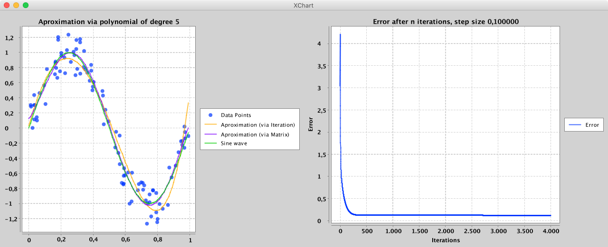

# Gradient Ascent Implementation

## Resulting Polynomes

f_itr(x) = 0.031767987732920076*x^0 + 7.573337387150479*x^1 + -15.951620373046708*x^2 + -2.4384047417973336*x^3 + 7.068569618767389*x^4 + 4.219357841007244*x^5

f_mtx(x) = f0.12423788007277264*x^0 + 2.726975997733779*x^1 + 27.183599808165678*x^2 + -135.28938939890563*x^3 + 171.93214472809962*x^4 + -66.61422340275125*x^5