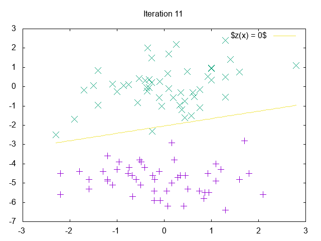

# Week 2

## Result




## Running the algorithm

```
$ cat var/data.txt | clj -m logistic-regression 0.4 1000 > var/iterations.txt
$ #                              learning-rate --^    ^-- iteration limit
```

## Plotting the data (latex)

```
$ gnuplot plots/data.plt
```

## Animated plot

```
$ cat var/iterations.txt | php plots/animate.plt.php 10 | gnuplot
$ #   ^                    plot each 10th iteration -^
$ #   precomputed values
```

or

```
$ cat var/data.txt | clj -m logistic-regression 0.05 0  | php plots/animate.plt.php 10 | gnuplot
```
